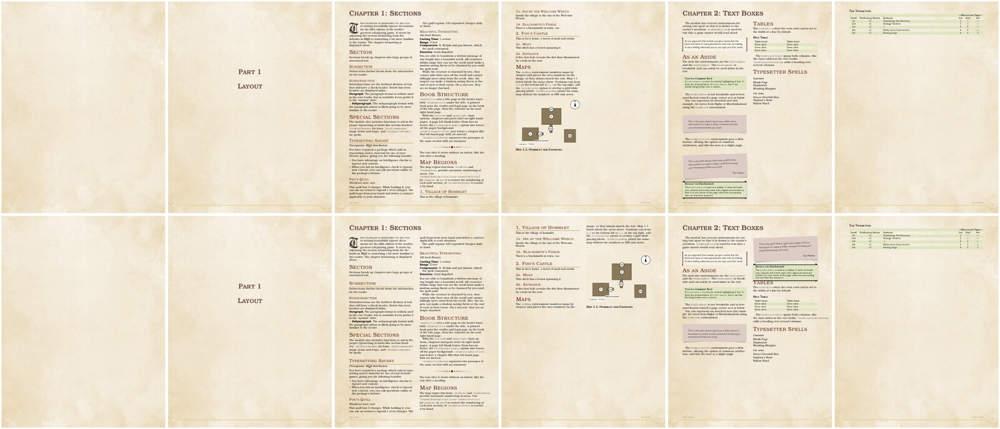

# Typography of the 2014 core books

Measurements the template's body text and headings are set from, and how the template compares. Written for issue #6.

## Sources

No page scans were measured for this document. The values are second-hand, from the most widely used recreation of the 2014 Player's Handbook layout:

- **Homebrewery**, 5ePHB theme: [`themes/V3/5ePHB/style.less`](https://github.com/naturalcrit/homebrewery/blob/18e9aa59a9dd57ee2954214bafdbe857780093c1/themes/V3/5ePHB/style.less) and the page setup in [`themes/V3/Blank/style.less`](https://github.com/naturalcrit/homebrewery/blob/18e9aa59a9dd57ee2954214bafdbe857780093c1/themes/V3/Blank/style.less), commit `18e9aa5` (2026-09-15), read on 2026-09-27. Sizes are in centimetres at US Letter size; 1 cm = 28.45 pt.

Check a value against a real page before relying on it: measure the cap height or baseline-to-baseline distance of ten lines with a ruler, and compare.

## Measurements and the template

Template values are for the default 10pt class option; heading sizes scale with the body size (`\DndRelativeSize`).

| Element | Homebrewery | In points | Template before | Template now |
| ------- | ----------- | --------- | --------------- | ------------ |
| Body text | 0.34 cm, line height 1.25 | 9.7pt on 12.1pt | 10pt on 12pt | unchanged (within a point) |
| Sidebar and table text (sans) | 0.318 cm, line height 1.2 | 9.0pt on 10.9pt | per box styles | unchanged |
| Chapter title (h1) | 0.89 cm | 25.3pt | `\Huge`, 24.9pt | unchanged |
| Section (h2) | 0.75 cm | 21.3pt | `\huge`, 20.7pt | unchanged |
| Subsection (h3, gold rule) | 0.575 cm | 16.4pt | `\Large`, 14.4pt | **16.4pt** |
| Subsubsection (h4) | 0.458 cm | 13.0pt | `\large`, 12pt | **13.0pt** |
| Table title (h5, sans small caps) | 0.423 cm | 12.0pt | `DndFontTableTitle` | unchanged |
| Space after a paragraph, before any heading | 0.325 cm | 9.2pt | 1.3–2ex (about 5.6–8.6pt) | **9.2pt** |
| Space below a subsection's rule | 0.17 cm | 4.8pt | 1.2ex (about 5.2pt) | **4.8pt** |
| Space below a subsubsection | 0.09 cm | 2.6pt | 0.2ex (about 0.9pt) | **2.6pt** |
| Column gap | 0.9 cm | 0.354in | 0.33in | unchanged |
| Page margins (top, sides, bottom) | 1.4, 1.9, 1.7 cm | 0.55, 0.75, 0.67in | 0.46, 0.75, 0.8in (bottom includes the footer) | unchanged |

Page geometry was left alone: the template's footer sits inside the bottom margin, while Homebrewery's page padding does not include one, so the two are not directly comparable. Revisit with a real page.

WotC's own SRD 5.2.1 PDF is 594 × 783pt, a trim size of 8.25 × 10.875in, slightly smaller than US Letter. That document uses the 2024 layout, so it is only a hint for the 2014 books' trim size; the template keeps US Letter, which print-on-demand services offer.

## Text

| Setting | Before | Now | Why |
| ------- | ------ | --- | --- |
| Hyphenation | never (`\hyphenpenalty=10000`, `\tolerance=1`, unlimited emergency stretch) | normal (`\hyphenpenalty=50`, `\tolerance=500`); `hyphenate=false` restores the old behaviour. Unlimited emergency stretch is kept for paragraphs with no acceptable breaks (long command names, URLs), so they are set loosely instead of running into the margin | The books hyphenate. Without it, ragged lines are very uneven and justified text gets wide gaps. |
| Widows and orphans | TeX defaults (150) | `\clubpenalty`, `\widowpenalty` and `\displaywidowpenalty` 9000 | No single line of a paragraph alone at the top or bottom of a column. Not 10000 (forbidden): then the balancing below cannot split a nearly full last page and stretches the right column instead. |
| Column bottoms | flush in two-sided documents | `\raggedbottom` | With widows and orphans forbidden, flush columns stretch the space between paragraphs. The books let columns end where their text ends. |
| Last page of a chapter | full left column, short right one | balanced (`flushend`, before each `\chapter`, `\part`, `\include`, facing art, sideways map, handout appendix and the end of the document); `balance=false` turns it off | The books end chapters with two columns of similar height. The `balance` package was tried first and loops forever with this template. |

## Before and after

The example document, pages 4–9, before (top) and after (bottom) these changes:

